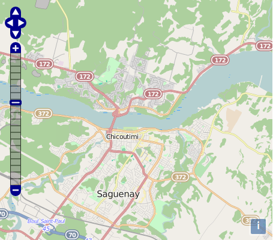

OL3-PanZoom
===========

This repository holds a `ol.control.PanZoom` control, which consists of the
integration of the `OpenLayers.Control.PanZoom` and
`OpenLayers.Control.PanZoomBar` controls from OpenLayers 2 into OpenLayers 3.

The `ol.control.PanZoom` control allows one to migrate their existing PanZoom
or PanZoomBar intergration from OpenLayers 2 into OpenLayers 3 with the same
definition and compatibility for styling.

Live examples
-------------

See OL3-Pan-Zoom in actions:

 * [PanZoom](http://labs.mapgears.com/ol3-panzoom/examples/maxextent.html)
 * [PanZoomBar](http://labs.mapgears.com/ol3-panzoom/examples/slider.html)
 * [PanZoomBar in black](http://labs.mapgears.com/ol3-panzoom/examples/black-slider.html)

See all other example at:
http://labs.mapgears.com/ol3-panzoom/examples/